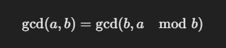

### What Does This Function Do?
This function calculates the Greatest Common Divisor (GCD) of two numbers using the Euclidean Algorithm.

### How the Euclidean Algorithm Works
The GCD of two numbers is the largest number that evenly divides both numbers. The Euclidean Algorithm states:

This means:

1. Replace a with b.
2. Replace b with a % b (the remainder of a divided by b).
3. Repeat until b becomes 0.
4. When b == 0, a is the GCD.

### Ex: Let's compute gcd(24, 36)
1. First Iteration:
* a = 24, b = 36
* Compute 24 % 36 = 24 (since 24 is smaller than 36)
* Swap: a = 36, b = 24

2. Second Iteration:
* a = 36, b = 24
* Compute 36 % 24 = 12
* Swap: a = 24, b = 12

3. Third Iteration:
* a = 24, b = 12
* Compute 24 % 12 = 0
* Swap: a = 12, b = 0
* Stop Condition Reached (b == 0)

Return a = 12 as the GCD(24, 36) = 12