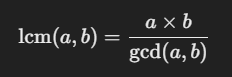
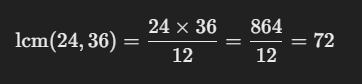

### What Does This Function Do?
This function calculates the Least Common Multiple (LCM) using the formula:

The LCM of two numbers is the smallest number that is a multiple of both.

### Why Does This Formula Work?
* If you multiply two numbers (a * b), you get a common multiple.
* But this might not be the smallest multiple.
* To avoid redundancy, divide by their GCD because GCD is the largest number that divides both.

This means:

1. Replace a with b.
2. Replace b with a % b (the remainder of a divided by b).
3. Repeat until b becomes 0.
4. When b == 0, a is the GCD.

### Ex: Let's compute gcd(24, 36)
1. Find GCD(24, 36)
From previous example: GCD = 12

2. Apply LCM Formula

LCM(24, 36) = 72