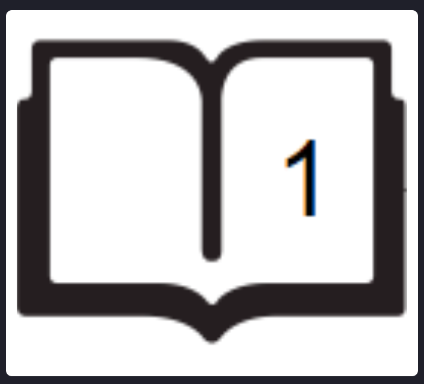
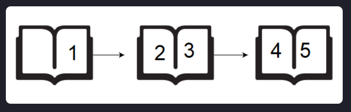

# DrawingBook

A teacher asks the class to open their books to a page number. A student can either start turning pages from the front 
of the book or from the back of the book. They always turn pages one at a time. When they open the book, page _1_ is always on the right side:

When they flip page _1_, they see pages _2_ and _3_. Each page except the last page will always be printed on both sides. 
The last page may only be printed on the front, given the length of the book. If the book is  pages long, and a student wants to turn to page _p_, 
what is the minimum number of pages to turn? They can start at the beginning or the end of the book.

Given _n_ and _p_, find and print the minimum number of pages that must be turned in order to arrive at page _p_.

## Example

    Ex: n = 5, p = 3

Using the diagram above, if the student wants to get to page _3_, they open the book to page _1_, flip _1_ page and they 
are on the correct page. If they open the book to the last page, page _5_, they turn  page and are at the correct page. Return _1_.

## Function Description

**pageCount** has the following parameter(s):

* int n: the number of pages in the book
* int p: the page number to turn to

## Returns
* int: the minimum number of pages to turn
